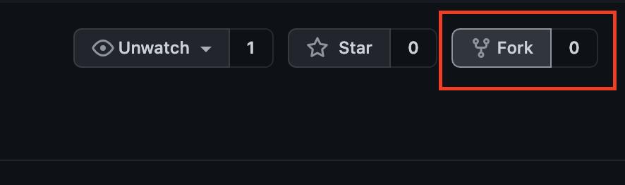
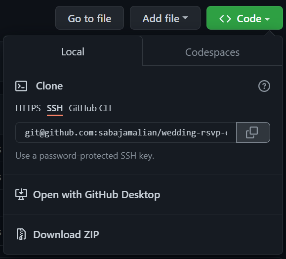
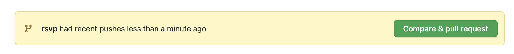
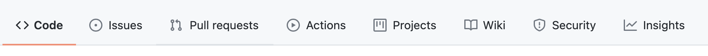
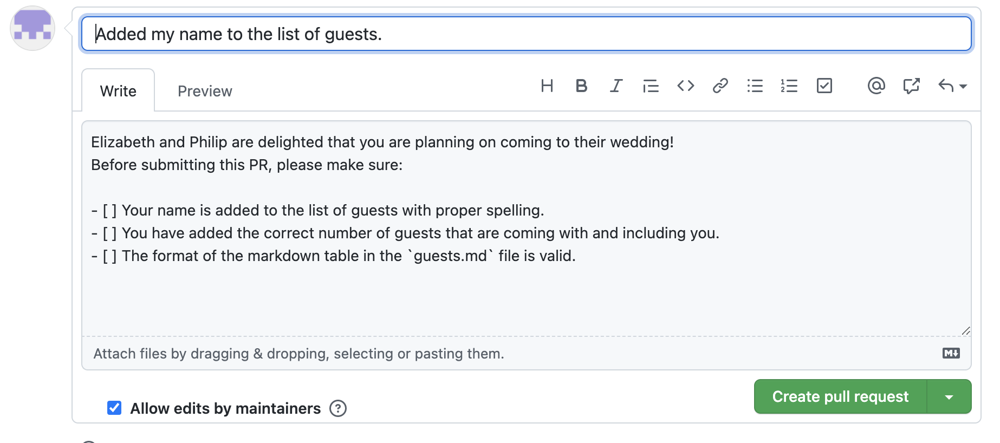

# Elizabeth & Philip
Elizabeth and Philip are inviting everyone to their wedding! They would like all the guests to RSVP to their wedding by adding their names to the list of the guests in this repository.

Let Elizabeth and Philip know if you can make it to their wedding by following the instructions!

## How to RSVP

### Assumptions
- You are currently signed into your GitHub account
- You have basic familiarity with Markdown
- You have Git command line tool installed on your computer, and it is set up to access your Github account

### Instructions
1. Start by forking the repository to your Github user account by clicking on the Fork button at the top right corner.



2. Clone the forked repository from your Github account onto your local computer. In order to clone, you need the URL of the repository. Click on the `Code` button to access the direct URL of the repository. 



Run the following command in your terminal. Replace the address with the address of the forked repository on your GitHub account. 

```
git clone git@github.com:Codecademy/wedding-rsvp-off-platform-project.git
```

3. Change your current directory of the terminal to the directory of the repository.

```
cd wedding-rsvp-off-platform-project
```

4. Create a new branch and name it `rsvp-[yourname]`. Run following command to create the new branch and also change the current working branch of the local repository to the newly created branch.

```
git checkout -b rsvp-yourname
```

5. Open the `guests.md` file using your text editor. This is a Markdown table that includes the list of all the guests who have RSVPed to the wedding. Add a new row to the table and include your name and the number of guests coming with you. Save your changes to the file. 

6. Commit your changes for Git to track. Put a message describing the change for your commit.

```
git commit -m "Added my name to the list of guests."
```

7. Push your changes to the forked repository in your GitHub account.

```
git push
```

6. On the main page of the repository, you should now see an option to create a pull request. Click on that to create a pull request from the `rsvp-yourname` branch of your forked repository to the `main` branch of the original repository. 



Alternatively, you can manually create a pull request by clicking on the pull request button: 



7. Github, by default, puts the message of the latest commit as the title of the pull request. Update the title to something more descriptive of the change. 
The description of the pull request is already filled with a template message (this template comes from the content of a markdown file at `docs/pull_request_template.md`. If such a file exists, Github uses it as a template for all the pull requests created from a branch to the main branch). Ensure all the requirements outlined in the checkboxes are met. 



Complete the creation of this pull request!
